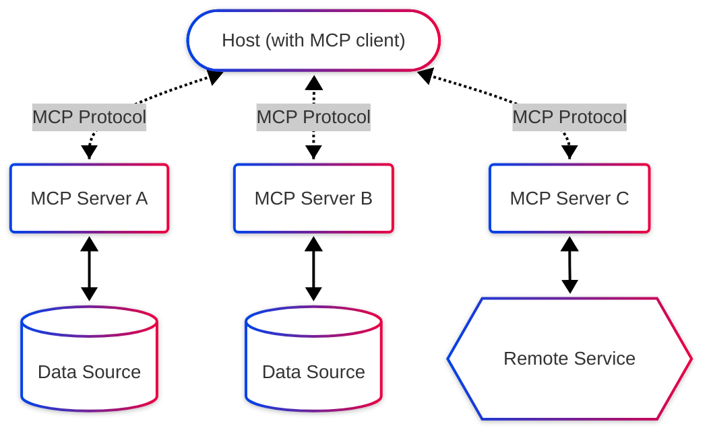

# Agent Oriented Architecture: From agentic software delivery to agentic systems
## Introduction: The rise of agentic development

We're witnessing an unprecedented transformation in how software gets built. AI agents are no longer just interesting experiments—they're actively reshaping the development landscape. [Cursor](https://cursor.com/) anticipates your next edit and executes complex refactorings. [Claude Code](https://github.com/anthropics/claude-code) transforms entire codebases between frameworks. [Replit Agent](https://docs.replit.com/replitai/agent) converts natural language into full-stack applications. [Jules](https://blog.google/technology/google-labs/jules/) autonomously resolves GitHub issues and creates pull requests.

These tools represent something profound: the enhancement of human workflows through intelligent automation. But I find myself wondering—what comes next? As we move from agents that help humans write software to software that is itself composed of collaborating agents, how do we architect these systems? Can we imagine tomorrow's agent workflows with human oversight rather than human direction?

This exploration leads us to Agent Oriented Architecture (AOA)—a paradigm that might represent the next evolution after Service Oriented Architecture, where autonomous agents become the primary value producing units of our systems.

## Understanding the architectural evolution: From SOA to AOA

### The promise and reality of Service Oriented Architecture

To understand where we might be heading, it's worth examining where we've been. Service Oriented Architecture emerged in the early 2000s with a compelling vision: break monolithic applications into modular, reusable services that could be composed into complex systems. SOA promised flexibility, reusability, and the ability to rapidly adapt to changing business needs through service composition.

The core principles of SOA were elegant: services should be autonomous, share contracts not classes, and be discoverable and composable. Enterprises invested heavily in Enterprise Service Buses (ESB) to orchestrate these services, creating what they hoped would be agile, adaptable architectures.

Yet SOA's reality often fell short of its promise. Organizations found themselves drowning in service governance, struggling with versioning nightmares, and building ESBs that became bottlenecks rather than enablers. The rigid contracts between services made evolution difficult. The centralized orchestration created single points of failure.

Many organizations have since moved to microservices architectures, which some see as "SOA done right"—smaller, more autonomous services with decentralized governance. But even microservices maintain the fundamental assumption that services are dumb executors of predefined operations. What if services could be intelligent?

### The ghost of discovery: A cautionary tale of premature standardisation

Before we get too excited about agent discovery protocols, we should remember UDDI (Universal Description, Discovery and Integration). [UDDI](https://en.wikipedia.org/wiki/Web_Services_Discovery) aimed to be the "yellow pages" of web services—a global directory where businesses would register their services and others would discover them dynamically.

The parallels to modern agent discovery are striking. UDDI promised automatic service discovery, dynamic binding, and seamless B2B integration. IBM, Microsoft, and SAP launched public UDDI registries with great fanfare. The vision was that services would register themselves, clients would discover them at runtime, and partnerships would form automatically.

The reality? By 2006, all public UDDI registries had shut down after becoming graveyards of test data and "hello world" services. The specification had ballooned to 420 pages. Microsoft removed UDDI from Windows Server entirely^[1]. 

Why did UDDI fail so spectacularly? The specification was overly complex, requiring SOAP expertise and extensive metadata. There were no quality verification mechanisms—anyone could register anything. Most critically, it solved a problem most organizations didn't actually have. Google simply indexing WSDL files proved more effective than the entire UDDI ecosystem.

Yet the dream of service discovery didn't die—it evolved. Today's A2A protocol bears remarkable similarities to UDDI's vision, but with crucial differences that might make all the difference.

## The new foundations: MCP and A2A protocols enable agent ecosystems

Two complementary protocols are emerging that could form the backbone of Agent Oriented Architecture. [Model Context Protocol (MCP)](https://modelcontextprotocol.io/) standardizes how agents connect to data and tools—Anthropic describes it as a "USB-C port for language models." [Agent-to-Agent (A2A) Protocol](https://github.com/google-a2a/A2A) enables agents to discover and collaborate across platforms. Together, they might create the infrastructure for truly autonomous agent systems.

### MCP: Giving agents agency through standardized tool access

MCP solves a fundamental problem: AI models exist in isolation from the data and tools they need. Before MCP, every AI application required custom integrations for each data source—an N×M complexity nightmare that anyone who's built production AI systems knows all too well.

MCP turns context into something the model can count on rather than something developers keep stitching together ad hoc. The protocol defines four core primitives: Tools (functions which agents can invoke), Resources (data agents which can access), Prompts (templates for optimal tool usage), and Sampling (allowing servers to request LLM completions during execution).

What makes MCP different from previous integration attempts is its simplicity and focus. Unlike heavyweight enterprise integration patterns, MCP uses lightweight JSON-RPC over standard transports. Any MCP-compatible agent can immediately access hundreds of pre-built integrations.

### A2A: Enabling autonomous agent collaboration through discovery

While MCP connects agents vertically to tools, A2A connects them horizontally to each other. A2A enables agents to discover each other's capabilities, negotiate interaction modalities, and collaborate on long-running tasks—all while operating without exposing their internal state, memory, or tools.

[A2A Agent Discovery & Collaboration Diagram would be inserted here]

The magic of A2A lies in its Agent Cards—think of them as intelligent business cards for AI agents. These standardised metadata documents detail the agent's capabilities, available skills, service endpoint, and security requirements, enabling other agents to discover and understand how to interact with it. Through DNS-based `.well-known` URLs or centralised registries, agents can find relevant collaborators without prior configuration.

But here's where A2A diverges from UDDI's rigid approach: A2A supports dynamic UX negotiation within tasks, stateful workflows with streaming updates, and multi-modal content negotiation. Instead of fixed service contracts, agents negotiate capabilities on the fly. The protocol embraces the inherent uncertainty and adaptability of AI systems rather than trying to constrain them.

### The complementary nature of MCP and A2A

Google carefully positioned A2A as complementary to MCP, using a car repair shop analogy: MCP connects agents to their tools ("raise platform by 2 meters"), while A2A enables communication about goals and context ("my car is making a rattling noise")^[2].

Yet some industry observers question whether this distinction is as clear-cut as claimed. As Solomon Hykes points out, "Tools are evolving into more agent-like systems and, conversely, agents are increasingly relying on tools to function effectively."^[3] The boundary between inter-agent communication and intelligent tool orchestration may be more fluid than the protocols suggest.

## AOA in practice: The explAIn demonstration

The [explAIn application](https://github.com/EqualExperts/explAIn/tree/master/A2A%20and%20MCP) demonstrates how MCP and A2A protocols can combine in practice to create a working Agent Oriented Architecture. Based on the emerging patterns from various A2A and MCP implementations^[4]^, it showcases several key principles:

### Dynamic capability extension through agent registry

In an AOA system, new capabilities can be added simply by registering new agents. The application discovers these agents' capabilities through their Agent Cards and automatically incorporates them into workflows. This represents a fundamental shift from traditional architectures where adding new functionality requires code changes and deployments.

### Automatic schema and data discovery

One of the persistent challenges in enterprise integration is handling schema evolution and data format variations. AOA agents can automatically discover data schemas through MCP connections and adapt their behavior accordingly. This self-configuration capability dramatically reduces the integration overhead that plagued SOA implementations.

### Emergent workflows through agent collaboration

Perhaps most intriguingly, AOA enables workflows that emerge from agent capabilities rather than being explicitly programmed. An orchestrator agent might receive a user request, discover available specialist agents through the registry, delegate subtasks based on their advertised capabilities, and synthesize the results—all without predefined workflow logic.

## Building tomorrow's autonomous systems: Opportunities and challenges

Agent Oriented Architecture represents more than an incremental improvement over Service Oriented Architecture—it's a fundamental reimagining of how software systems organize and operate. But several critical questions remain:

### The autonomy paradox

How much autonomy should agents have? Too little, and we're back to rigid service contracts. Too much, and we risk unpredictable system behavior. Finding the right balance between agent independence and system coherence will be crucial.

### Trust and verification in agent networks

UDDI failed partly because it had no quality verification mechanisms. How do we ensure agents are trustworthy and capable? The A2A protocol includes authentication and authorization in Agent Cards, but reputation systems and capability verification remain open challenges.

### The human oversight challenge

As we transition from human-directed to human-overseen systems, how do we maintain meaningful control? The interfaces for human oversight of agent networks are still in their infancy. We need new tools and patterns for understanding, debugging, and guiding autonomous agent systems.

### Performance and scalability considerations

Will the overhead of agent discovery and negotiation prove prohibitive at scale? Early implementations suggest the benefits outweigh the costs, but production deployments at enterprise scale will be the real test.

## Conclusion: The path forward

Agent Oriented Architecture offers a tantalizing glimpse of software's future—systems that can discover, adapt, and evolve autonomously while remaining under human oversight. By learning from SOA's struggles and UDDI's failures, we might finally realize the vision of truly flexible, composable systems.

The combination of MCP for tool access and A2A for agent collaboration provides a technical foundation that feels more pragmatic than previous attempts. These protocols embrace the probabilistic, adaptive nature of AI rather than trying to force it into rigid frameworks.

Yet we should approach this transformation with both excitement and caution. The history of software architecture is littered with promising paradigms that failed to deliver. Will AOA be different? The early signs are encouraging, but only time and real-world deployment will tell.

What seems certain is that the nature of software itself is changing. As AI agents evolve from development tools to system components, we need new architectural patterns to harness their potential. Agent Oriented Architecture offers one compelling vision for this future—a future where software doesn't just assist humans but actively collaborates to solve complex problems.

The question isn't whether this transformation will happen, but how we'll shape it. The protocols are emerging. The tools are being built. The opportunity is ours to seize.

## Footnotes

[1] See "UDDI R.I.P." by Stefan Tilkov (2010) and the Stack Overflow discussion "Is the public UDDI movement dead or, was it ever alive?"

[2] From the A2A documentation's "A2A ❤️ MCP" page, demonstrating how the protocols complement each other.

[3] Quoted in "A2A and MCP: Start of the AI Agent Protocol Wars?" - Koyeb blog

[4] Including the A2A and MCP Tutorial by Tsadoq and various implementations listed in the A2A Directory

## References

### Agentic Development Tools
- Cursor - The AI Code Editor: https://cursor.com/
- Claude Code by Anthropic: https://github.com/anthropics/claude-code
- Replit Agent Documentation: https://docs.replit.com/replitai/agent
- Jules by Google: https://blog.google/technology/google-labs/jules/

### Protocols and Specifications
- Model Context Protocol (MCP) by Anthropic: https://modelcontextprotocol.io/
- Agent-to-Agent Protocol (A2A) by Google: https://github.com/google-a2a/A2A
- A2A Protocol Specification: https://google.github.io/A2A/
- A2A vs MCP Comparison: https://github.com/sing1ee/a2a-directory/blob/main/docs/a2a-vs-mcp.md

### Implementation Examples
- explAIn Repository: https://github.com/EqualExperts/explAIn/tree/master/A2A%20and%20MCP
- A2A and MCP Tutorial by Tsadoq: https://github.com/Tsadoq/a2a-mcp-tutorial
- A2A Directory - Awesome A2A agents, tools, servers & clients: https://github.com/ai-boost/awesome-a2a

### Historical Context
- Service-Oriented Architecture (Wikipedia): https://en.wikipedia.org/wiki/Service-oriented_architecture
- UDDI (Universal Description, Discovery and Integration): https://en.wikipedia.org/wiki/Web_Services_Discovery
- "Is the public UDDI movement dead or, was it ever alive?" - Stack Overflow discussion: https://stackoverflow.com/questions/1525045/is-the-public-uddi-movement-dead-or-was-it-ever-alive
- "UDDI R.I.P." by Stefan Tilkov: https://www.innoq.com/blog/st/2010/03/uddi-r.i.p./

### Industry Analysis
- "A2A and MCP: Start of the AI Agent Protocol Wars?" by Koyeb: https://www.koyeb.com/blog/a2a-and-mcp-start-of-the-ai-agent-protocol-wars
- "Building AI Agents? A2A vs. MCP Explained Simply" - KDnuggets: https://www.kdnuggets.com/building-ai-agents-a2a-vs-mcp-explained-simply
- "How MCP and A2A Protocols Are Changing Enterprise GTM": https://arisegtm.com/blog/how-mcp-and-a2a-protocols-are-changing-enterprise-gtm

### Technical Deep Dives
- "A2A Protocol: Deep Dive" - DEV Community: https://dev.to/vishalmysore/a2a-protocol-deep-dive-3707
- "A2A and MCP Combined Implementation" - DEV Community: https://dev.to/heetvekariya/a2a-and-mcp-combined-implementation-5bg9
- "MCP Security 101: A New Protocol for Agentic AI": https://protectai.com/blog/mcp-security-101