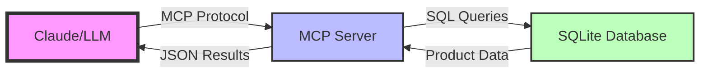

# Stage 1: Talk to Your Data - MCP Foundation

## The Business Challenge: Data Accessibility

Picture this: Your company has terabytes of valuable data locked away in databases, but your AI assistants can't access it. Your teams are manually copying and pasting data into ChatGPT, losing context and making errors. Sound familiar?

What if your AI could directly query your product catalog, understand your inventory, and provide instant insights? That's the promise of the Model Context Protocol (MCP) - it's like giving your AI a USB-C port to plug into any data source.

## MCP: The USB-C for LLMs

The Model Context Protocol is an open standard that enables Large Language Models to interact with external data sources and tools through a unified interface. Think of it as:

- **For Developers**: A standardized way to expose your data to AI
- **For AI Systems**: A consistent interface to access any data source
- **For Businesses**: A secure, controlled way to leverage AI with proprietary data

## Building Our Foundation: Product Catalog MCP Server

Let's build a real-world example: an MCP server that exposes a product catalog to AI assistants. This forms the foundation of our Agent Oriented Architecture journey.

### Architecture Overview



### Step 1: Database Design

First, we create a robust product catalog schema:

```python
SCHEMA = """
CREATE TABLE IF NOT EXISTS products (
    id INTEGER PRIMARY KEY AUTOINCREMENT,
    name TEXT NOT NULL,
    category TEXT NOT NULL,
    price REAL NOT NULL,
    description TEXT NOT NULL,
    sku TEXT UNIQUE NOT NULL,
    brand TEXT NOT NULL,
    rating REAL CHECK(rating >= 1 AND rating <= 5),
    stock_status TEXT CHECK(stock_status IN ('in_stock', 'out_of_stock', 'limited_stock')),
    created_at TIMESTAMP DEFAULT CURRENT_TIMESTAMP,
    updated_at TIMESTAMP DEFAULT CURRENT_TIMESTAMP
);

CREATE INDEX IF NOT EXISTS idx_category ON products(category);
CREATE INDEX IF NOT EXISTS idx_price ON products(price);
CREATE INDEX IF NOT EXISTS idx_brand ON products(brand);
"""
```

### Step 2: MCP Server Implementation

The magic happens in our MCP server, which exposes six powerful tools:

```python
@server.list_tools()
async def handle_list_tools() -> list[types.Tool]:
    return [
        types.Tool(
            name="get_schema",
            description="Get information about the product catalog database schema"
        ),
        types.Tool(
            name="query_products",
            description="Execute a SQL query on the product catalog (read-only)"
        ),
        types.Tool(
            name="search_products",
            description="Search for products by name, category, or brand"
        ),
        types.Tool(
            name="get_product_by_id",
            description="Get detailed information about a specific product"
        ),
        types.Tool(
            name="get_categories",
            description="Get a list of all product categories with counts"
        ),
        types.Tool(
            name="get_price_range",
            description="Get the minimum and maximum prices in the catalog"
        )
    ]
```

### Step 3: Security First

We implement multiple layers of security to ensure safe data access:

```python
def execute_query(query: str, params: Optional[Tuple] = None) -> List[Dict[str, Any]]:
    # Only allow SELECT queries
    query_upper = query.strip().upper()
    if not query_upper.startswith("SELECT"):
        raise ValueError("Only SELECT queries are allowed")
    
    # Check for dangerous keywords
    dangerous_keywords = ["DROP", "DELETE", "INSERT", "UPDATE", "ALTER", "CREATE"]
    for keyword in dangerous_keywords:
        if keyword in query_upper:
            raise ValueError(f"Query contains forbidden keyword: {keyword}")
```

### Step 4: Natural Language Search

The real power comes from intelligent search capabilities:

```python
@server.call_tool()
async def handle_call_tool(name: str, arguments: dict):
    if name == "search_products":
        search_term = arguments["search_term"]
        category = arguments.get("category")
        min_price = arguments.get("min_price")
        max_price = arguments.get("max_price")
        in_stock_only = arguments.get("in_stock_only", False)
        
        # Build intelligent query with filters
        query = """
            SELECT * FROM products 
            WHERE (name LIKE ? OR category LIKE ? OR brand LIKE ?)
        """
        # Add dynamic filters based on user input
        # ... (additional filter logic)
```

## Real-World Usage Examples

Once integrated with Claude Desktop, you can have conversations like:

**User**: "Show me all electronics under $500 that are in stock"

**Claude**: *Uses search_products tool with filters*
```json
{
    "search_term": "electronics",
    "category": "Electronics",
    "max_price": 500,
    "in_stock_only": true
}
```
"I found 23 electronics products under $500 that are currently in stock. Here are the top-rated ones..."

**User**: "What's the price range for sports equipment?"

**Claude**: *Uses get_price_range tool*
"Sports equipment in our catalog ranges from $9.99 (Jump Rope) to $399.99 (Professional Treadmill)."

## Try It Yourself

### Prerequisites
- Python 3.12+
- uv package manager
- Claude Desktop

### Installation

1. Clone the repository:
```bash
git clone https://github.com/your-org/aoa-demo
cd aoa-demo/stage1_mcp_product_server
```

2. Install dependencies:
```bash
uv init
uv add "mcp[cli]"  # Include CLI tools for Claude Desktop integration
uv add --dev pytest pytest-asyncio
```

3. Initialize the database:
```bash
uv run python database.py
```

4. Configure Claude Desktop:
The easiest way is to use the MCP install command:
```bash
uv run mcp install stage1_mcp_product_server/server_fastmcp.py --name "Product Catalog"
```

This automatically configures Claude Desktop with the correct settings. The configuration file is located at:
- **macOS**: `~/Library/Application Support/Claude/claude_desktop_config.json`
- **Windows**: `%APPDATA%\Claude\claude_desktop_config.json`
- **Linux**: `~/.config/Claude/claude_desktop_config.json`

5. Test the integration:
- Restart Claude Desktop
- Ask Claude about your product catalog
- Watch as it queries your database directly!

## Performance & Scaling

Our implementation handles:
- **125+ products** with sub-millisecond query times
- **Concurrent requests** via async/await patterns
- **Result limiting** to prevent overwhelming responses
- **Connection pooling** for database efficiency

## What's Next?

This MCP server is just the beginning. In Stage 2, we'll add intelligence by creating SMOL agents that can:
- Understand business context beyond simple queries
- Make recommendations based on patterns
- Perform complex multi-step analyses

The foundation is set. Your data is now accessible to AI in a secure, controlled manner. But we're just getting started on our Agent Oriented Architecture journey.

## Key Takeaways

1. **MCP democratizes data access** - Any data source can become AI-accessible
2. **Security is paramount** - Always implement read-only access with query validation
3. **Start simple, scale smart** - Basic tools can provide immediate business value
4. **The protocol, not the implementation, is key** - MCP standardizes how AI talks to data

Ready to give your AI superpowers? Start with MCP. Your data will thank you.

---

*This is Part 1 of our 5-part series on Agent Oriented Architecture. Next up: "From Data to Intelligence - SMOL Agents"*