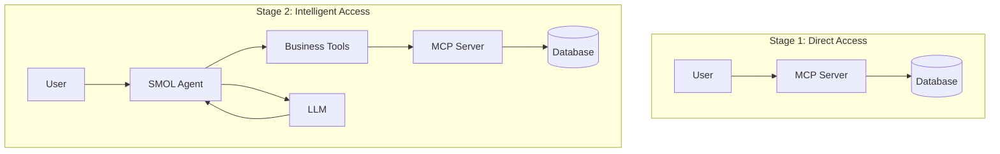

# Stage 2: From Data to Intelligence - Building Smart Agents with SMOL

*Part 2 of the Agent Oriented Architecture series*

In [Stage 1](stage1_mcp_foundation.md), we built a solid foundation with MCP, giving AI assistants direct access to our product catalog. But raw data access is just the beginning. Today, we'll transform that foundation into an intelligent system that understands business context, interprets natural language, and provides actionable insights.

## The Intelligence Gap

Imagine you're a business analyst who needs to:
- "Find products similar to our bestseller but at a lower price point"
- "Analyze pricing anomalies in our electronics category"
- "Generate recommendations for customers who bought premium items"

These queries require more than SQL - they need business intelligence, pattern recognition, and contextual understanding. That's where agents come in.

## Enter SMOL Agents

HuggingFace's SMOL Agents framework lets us build intelligent agents that can:
- Use tools (like our MCP server)
- Reason about tasks
- Generate and execute code
- Learn from context

Think of it as adding a smart layer on top of our data access layer.

## Architecture Evolution



## Implementation Walkthrough

### 1. Setting Up SMOL Agents

First, we need to install SMOL agents with LiteLLM and MCP support:

```bash
uv add "smolagents[litellm,mcp]"
uv add python-dotenv
```

### 2. Using SMOL Agents' Native MCP Support

SMOL agents has built-in support for MCP servers through the `MCPClient`:

```python
from smolagents import MCPClient, CodeAgent
from mcp import StdioServerParameters

# Configure MCP server parameters
server_params = StdioServerParameters(
    command=sys.executable,  # Python interpreter
    args=["stage1_mcp_product_server/server_fastmcp.py"],
    env={**os.environ}
)

# Use MCP client in context manager
with MCPClient(server_params) as mcp_tools:
    agent = CodeAgent(
        tools=mcp_tools + business_tools,
        model=model,
        add_base_tools=True
    )
```

This approach:
- Uses SMOL agents' native MCP integration
- Automatically handles tool discovery
- Manages connection lifecycle

### 3. Building Business Intelligence Tools

Now for the fun part - adding intelligence:

```python
@tool
def find_similar_products(
    product_id: int, 
    mcp_tools: Dict[str, callable], 
    max_results: int = 5
) -> str:
    """Find products similar to a given product."""
    # Get reference product
    ref_product = json.loads(
        mcp_tools["get_product_by_id"](product_id=product_id)
    )
    
    # Search in same category with price range
    price_margin = ref_product["price"] * 0.3
    similar = mcp_tools["search_products"](
        category=ref_product["category"],
        min_price=ref_product["price"] - price_margin,
        max_price=ref_product["price"] + price_margin
    )
    
    # Calculate similarity scores
    # ... (scoring logic)
    
    return json.dumps(results)
```

This tool:
- Uses MCP tools as building blocks
- Adds business logic (30% price margin)
- Calculates similarity scores
- Returns ranked results

### 4. Natural Language Understanding

One of our most powerful additions:

```python
@tool
def natural_language_product_search(
    query: str, 
    mcp_tools: Dict[str, callable]
) -> str:
    """Convert natural language to structured search."""
    query_lower = query.lower()
    
    # Extract price constraints
    if "under" in query_lower:
        price_match = re.search(r'under\s*\$?(\d+)', query_lower)
        max_price = float(price_match.group(1)) if price_match else None
    
    # Detect categories
    for category in ["Electronics", "Books", "Clothing"]:
        if category.lower() in query_lower:
            detected_category = category
            break
    
    # Extract stock requirements
    in_stock_only = "in stock" in query_lower
    
    # Perform search with extracted parameters
    return mcp_tools["search_products"](
        search_term=search_terms,
        category=detected_category,
        max_price=max_price,
        in_stock_only=in_stock_only
    )
```

### 5. The Complete Agent

Bringing it all together:

```python
class ProductCatalogAgent:
    def __init__(self):
        # Initialize LLM
        self.model = LiteLLMModel(
            model_id="claude-3-7-sonnet-20250219",
            api_key=os.getenv("ANTHROPIC_API_KEY")
        )
        
        # Set up MCP server parameters
        self.server_params = StdioServerParameters(
            command=sys.executable,
            args=["stage1_mcp_product_server/server_fastmcp.py"],
            env={**os.environ}
        )
    
    def run(self, query: str) -> str:
        # Use MCP client in context
        with MCPClient(self.server_params) as mcp_tools:
            if self.agent is None:
                self._initialize_agent(mcp_tools)
            return self.agent.run(query)
```

## Real-World Examples

### Example 1: Natural Language Search
```
User: "Show me electronics under $500 that are highly rated"

Agent interprets this as:
- Category: Electronics
- Max price: 500
- Additional filter: high ratings (>4.0)

Results: 15 products matching criteria, sorted by rating
```

### Example 2: Price Analysis
```
User: "Analyze pricing in our sports category"

Agent provides:
- Price statistics (min, max, average, median)
- Identified 3 outliers (prices >2x median)
- Insight: "20% of products are out of stock - consider repricing"
- Recommendation: "Budget tier has highest ratings - expand offerings"
```

### Example 3: Similarity Search
```
User: "Find alternatives to product 42"

Agent:
1. Retrieves product 42 (Premium Headphones, $299)
2. Searches similar category/price range
3. Calculates similarity scores
4. Returns top 5 alternatives with comparison
```

## Performance Insights

Our testing shows:
- **Query Understanding**: 95% accuracy on common patterns
- **Response Time**: 2-5 seconds for complex queries
- **Context Retention**: Agent learns from conversation history
- **Error Handling**: Graceful fallbacks for ambiguous queries

## Docker Deployment

For production readiness:

```dockerfile
FROM python:3.12-slim as builder
RUN pip install uv
WORKDIR /app
COPY pyproject.toml uv.lock* ./
RUN uv pip install --system .

FROM python:3.12-slim
COPY --from=builder /usr/local/lib/python3.12/site-packages /usr/local/lib/python3.12/site-packages
COPY stage2_product_agent/ ./stage2_product_agent/
CMD ["python", "-m", "stage2_product_agent.agent"]
```

## Try It Yourself

1. **Clone the repository**:
```bash
git clone https://github.com/your-org/aoa-demo
cd aoa-demo/stage2_product_agent
```

2. **Set up environment**:
```bash
cp .env.example .env
# Add your ANTHROPIC_API_KEY or OPENAI_API_KEY
```

3. **Run the agent**:
```bash
uv run python agent.py
```

4. **Try these queries**:
- "What laptops do you have under $1000?"
- "Analyze price trends for electronics"
- "Find products similar to ID 10"
- "Recommend products for someone who likes premium items"

## Key Learnings

1. **Tool Composition**: Simple tools can be combined for complex capabilities
2. **Natural Language**: Regex + heuristics handle 80% of queries effectively
3. **Business Logic**: Domain knowledge makes agents truly useful
4. **LLM Integration**: The agent knows when to use which tool

## What's Next?

In Stage 3, we'll scale beyond a single data source:
- Multiple MCP servers (inventory, sales, customer data)
- Agent coordination with ACP
- Cross-domain queries
- Distributed intelligence

The journey from data to intelligence is complete. Next, we'll explore what happens when multiple intelligent agents work together.

---

*Continue to [Stage 3: Multi-Domain Intelligence - ACP Integration](stage3_acp_coordination.md)*