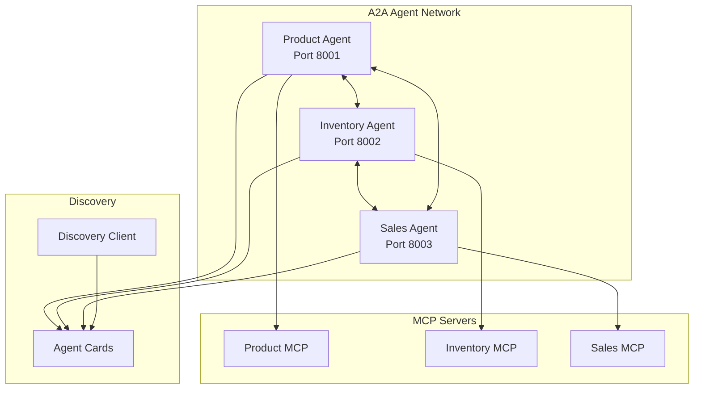

# Stage 3: Implementing the A2A Protocol - Agent-to-Agent Communication

*Part 3 of the Agent Oriented Architecture series*

In Stage 2, we wrapped our MCP server with a SMOL agent to create an intelligent Product Catalog Agent. Now, we're taking the next leap: enabling multiple agents to discover and communicate with each other using Google's A2A (Agent-to-Agent) protocol.

## Why A2A Protocol?

As we build more specialized agents, we need them to work together. Imagine:
- A Product Agent that needs inventory data before confirming availability
- An Inventory Agent that needs sales data to predict stockouts
- A Sales Agent that needs product details for revenue analysis

The A2A protocol provides:
1. **Standardized Discovery**: Agents can find each other dynamically
2. **Capability Negotiation**: Agents advertise what they can do
3. **Structured Communication**: Type-safe message passing
4. **Async Task Handling**: Long-running operations without timeouts

## Architecture Overview



## Key Implementation Details

### 1. Base A2A Agent

Every A2A agent extends our `BaseA2AAgent` class:

```python
class BaseA2AAgent(AgentExecutor):
    """Base class for A2A-compatible agents with SMOL agent integration."""
    
    def __init__(self, agent_name: str, smol_agent: Any = None):
        self.agent_name = agent_name
        self.smol_agent = smol_agent
        self.discovery_client = DiscoveryClient()
        self.known_agents = {}
    
    async def execute(self, context: RequestContext, event_queue: EventQueue):
        """Handle incoming A2A messages."""
        # Extract message using model_dump() for A2A SDK compatibility
        message = self._parse_a2a_message(context.message)
        
        # Route to appropriate handler
        if self._should_use_async_task(message):
            await self._start_async_task(message, context, event_queue)
        else:
            result = await self._execute_with_smol_agent(message)
            await event_queue.enqueue_event(new_agent_text_message(result))
```

### 2. Message Parsing Fix

The A2A SDK uses Pydantic models with a specific structure. We discovered messages arrive as `Part` objects with a `root` attribute:

```python
def _parse_a2a_message(self, message):
    """Parse A2A message handling Part.root structure."""
    for part in message.parts:
        if hasattr(part, 'model_dump'):
            part_data = part.model_dump()
            if 'text' in part_data:
                return part_data['text']
        elif hasattr(part, 'root') and hasattr(part.root, 'text'):
            return part.root.text
```

### 3. Async Task Handling

To prevent timeouts on complex queries, we implement intelligent routing:

```python
async def _execute_with_smol_agent(self, query: str) -> str:
    """Execute queries with appropriate timeout handling."""
    simple_queries = ['hello', 'help', 'what can you do']
    is_simple = any(simple in query.lower() for simple in simple_queries)
    
    if is_simple:
        # Quick response for simple queries
        result = await asyncio.wait_for(
            asyncio.to_thread(self.smol_agent.run, query),
            timeout=5.0
        )
    else:
        # Async task for complex queries
        task_id = str(uuid.uuid4())
        asyncio.create_task(self._process_async_query(query, task_id))
        result = f"Processing task {task_id}. This may take a moment..."
    
    return result
```

### 4. Agent Discovery

Agents can discover each other dynamically:

```python
class DiscoveryClient:
    """Client for discovering A2A agents."""
    
    async def discover_agents_on_ports(self, ports=[8001, 8002, 8003]):
        """Discover agents by checking well-known endpoints."""
        agents = []
        for port in ports:
            try:
                response = await client.get(
                    f"http://localhost:{port}/.well-known/agent-card.json"
                )
                if response.status_code == 200:
                    card = response.json()
                    # Normalize A2A format (skills -> capabilities)
                    if "skills" in card:
                        card["capabilities"] = card["skills"]
                    agents.append(card)
            except:
                pass
        return agents
```

### 5. Inter-Agent Communication

Agents communicate using JSON-RPC format:

```python
async def query_other_agent(self, agent_name: str, query: str):
    """Query another agent in the network."""
    # Find the agent
    agent_card = self.known_agents.get(agent_name)
    if not agent_card:
        agents = await self.discovery_client.discover_agents_on_ports()
        # ... find matching agent
    
    # Send JSON-RPC request
    payload = {
        "jsonrpc": "2.0",
        "method": "message/send",
        "params": {
            "message": {
                "messageId": f"msg-{int(time.time())}",
                "role": "user",
                "parts": [{"text": query}]
            }
        },
        "id": f"req-{int(time.time())}"
    }
    
    response = await client.post(agent_url, json=payload)
    return response.json()["result"]
```

## Running the Multi-Agent System

### 1. Setup Environment

```bash
cd stage3_multi_agent
cp .env.example .env
# Add your ANTHROPIC_API_KEY to .env
```

### 2. Start All Agents

```bash
# Using Docker
docker-compose up

# Or run individually
python agents/product_agent_a2a.py
python agents/inventory_agent_a2a.py
python agents/sales_agent_a2a.py
```

### 3. Test Agent Discovery

```bash
python test_scripts/test_agent_discovery.py
```

Output:
```
=== Testing Agent Discovery ===

Found 3 agents:
  - Product Catalog Agent at http://localhost:8001
    Capabilities: ['search_products', 'analyze_prices', 'find_similar_products']
  - Inventory Management Agent at http://localhost:8002
    Capabilities: ['check_stock', 'optimize_restocking', 'predict_stockouts']
  - Sales Analytics Agent at http://localhost:8003
    Capabilities: ['sales_summary', 'analyze_returns', 'customer_insights']
```

### 4. Demo Inter-Agent Communication

```bash
python demo_agent_communication.py
```

This demonstrates:
- Agents discovering each other
- Direct agent-to-agent queries
- Capability-based routing
- Multi-agent collaboration scenarios

## Real-World Example: Product Availability Check

Here's how agents work together to answer a complex query:

```python
# User asks Product Agent: "Do we have gaming laptops under $1500 in stock?"

# 1. Product Agent searches its catalog
products = await product_agent.search_products(
    query="gaming laptop",
    filters={"max_price": 1500}
)

# 2. Product Agent queries Inventory Agent for stock levels
for product in products:
    stock_response = await product_agent.query_other_agent(
        agent_name="Inventory Management Agent",
        query=f"Check stock for product {product['id']}"
    )
    product['in_stock'] = stock_response['available'] > 0

# 3. Return consolidated response
return {
    "products": products,
    "summary": f"Found {len(in_stock_products)} gaming laptops under $1500 in stock"
}
```

## Key Learnings

1. **Protocol Compatibility**: A2A SDK has specific message formats and JSON-RPC requirements
2. **Timeout Management**: Essential for SMOL agents doing complex LLM operations
3. **Discovery Patterns**: Agents need both static (ports) and dynamic (registry) discovery
4. **Error Handling**: Robust error handling prevents cascading failures in multi-agent systems

## What's Next?

In Stage 4, we'll implement:
- **A2A Registry**: Central service for agent registration and discovery
- **Dynamic Scaling**: Agents that spawn specialized sub-agents on demand
- **State Management**: Distributed state across agent networks
- **Advanced Routing**: Capability-based request routing and load balancing

## Try It Yourself

1. Clone the repository and navigate to stage3_multi_agent
2. Copy `.env.example` to `.env` and add your API key
3. Run `docker-compose up` to start all agents
4. Experiment with the demo scripts to see agents communicating

The A2A protocol transforms our isolated agents into a collaborative network, where each agent's specialized capabilities contribute to solving complex, multi-domain problems.

## Resources

- [A2A Protocol Specification](https://github.com/google/a2a)
- [Complete Code on GitHub](https://github.com/your-repo/AOA/tree/main/stage3_multi_agent)
- [Google's Agent Architecture Vision](https://ai.google.dev/agents)

---

*Next: Stage 4 - A2A Registry and Dynamic Agent Discovery*